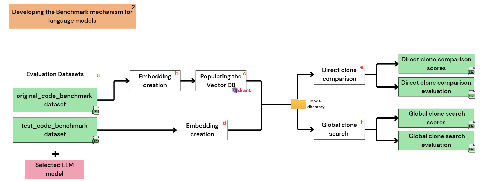

# CodeMatch Benchmark - Can the System Detect Clones Accurately?

The Benchmark repository is where we start measuring success. It’s all about testing and evaluating Large Language Models (LLMs) to ensure they perform well in detecting code clones. This repository lays the groundwork for the CodeMatch project, helping us identify the best-performing model for the job.


## 📖 Introduction

The benchmark component is critical for evaluating LLMs on their ability to detect code clones. It replicates the system's key functionalities at scale, ensuring that each model is rigorously tested. The benchmark process involves:

- Generating embeddings for code snippets.
- Running two evaluation methods to measure similarity and retrieval accuracy.
    1. **Direct Clone Comparison Test**: Measuring similarity between pairs of code snippets.
    2. **Global Clone Search**: Identifying the closest original code snippets from a database for given clones.
- Producing metrics and results in structured CSVs to analyze model performance.

By focusing on these elements, the benchmark helps determine the best model to integrate into the CodeMatch system.


## Workflow Steps in Benchmark

<br><br>

1. **Finding/Creating Datasets**: The first step involves gathering or creating datasets tailored for evaluating LLMs. These datasets consist of original code snippets and their clones, covering various programming languages and clone types (e.g., exact, renamed, semantic).
2. **Developing a Benchmark Mechanism**: This step focuses on evaluating multiple LLMs using the created datasets to determine their ability to detect code clones. It involves a detailed scoring mechanism based on similarity metrics.
3. **Training/Fine-Tuning the Chosen LLM**: Although part of the workflow, this step was executed using prompt engineering rather than custom fine-tuning, leveraging the selected LLM's capabilities without additional training.

Out of these three steps, **only the first two are implemented in this repository**:
- Step 1: Dataset Creation - additional information can be found in the `data` [folder](https://github.com/codematch-llm/benchmark/tree/main/data) in this repository.
- Step 2: Benchmark Development - we will delve into this here.


## Step 2 - Workflow


<br>

**a. Evaluation Datasets**: Two evaluation datasets generated in Step 1 (documented in the `data` folder) are used along with the selected LLM. This setup replicates the final system's workflow to benchmark its performance.

**b-c. Embedding Original Code**: Each original code snippet in the `original_code_benchmark` dataset is embedded using the selected LLM. The embeddings are stored in a dedicated collection within the vector database (Qdrant).

**d. Running the System for Evaluation**: With the embeddings of the original code stored, the system is "run" using the selected LLM model to assess its performance against the test dataset.

Before moving to Steps **e** and **f**, note that these represent the two evaluation methods, each producing two outputs:
   - **Scores**: The system's raw output for the given method.
   - **Evaluation**: Performance metrics based on specific criteria for the method.

These files are stored in the `output` folder, with separate subfolders created for each LLM model tested.

**e. Direct Clone Comparison**: This method directly compares each test code embedding to its corresponding original embedding in the vector database. It evaluates the system's ability to accurately identify clone relationships within known pairs, generating similarity scores and evaluations.

**f. Global Clone Search**: In this method, each test code embedding is searched against the entire vector database. This approach assesses the system's ability to retrieve the most similar code snippets globally. Similarity scores and corresponding evaluations are recorded to analyze performance.


## Evaluated Models

The following models have been benchmarked in this project:

- **`codebert-base`** - [Hugging Face](https://huggingface.co/microsoft/codebert-base)
- **`graphcodebert-base`** - [Hugging Face](https://huggingface.co/microsoft/graphcodebert-base)
- **`codet5-base`** - [Hugging Face](https://huggingface.co/Salesforce/codet5-base)
- **`Qwen2.5-Coder-0.5B`** - [Hugging Face](https://huggingface.co/Qwen/Qwen2.5-Coder-0.5B)
- **`Qwen2.5-Coder-0.5B-pe`** (prompt-engineered version)

to choose the desired model go to `config.py` and uncomment the model name.


## Folder Structure

The repository is organized into the following key folders:

- **`EDA-and-visualizations/`**:
  - Contains exploratory data analysis (EDA) of the Rosetta dataset.
  - Includes evaluation of the output CSVs generated by running each model.
- **`core/`**:
  - Core modules for managing database interactions, logging, utility functions, and metrics evaluation.
- **`data/`**:
  - Contains dataset files and scripts for dataset creation.
- **`logs/`**:
  - Stores logs for debugging and tracking benchmark execution.
- **`output/`**:
  - Stores evaluation CSVs and results generated for each model.
- **`scripts/`**:
  - Contains scripts for various tasks.


## Additional Key Features

1. **Logging**:
   - Logs are added throughout the project to capture progress, errors, and important metadata.
   - Logs are stored in a dedicated `logs` folder for detailed debugging and tracking.
2. **Multiprocessing**:
   - Utilized to run both evaluation methods in parallel, reducing runtime.
3. **Local Model Management**:
   - Automatically downloads and caches the selected model locally if not already present, ensuring smooth execution without manual intervention.


## Modular Design

The project is designed with modularity in mind, separating core functionalities into distinct modules:

1. **`config.py`**:
   - Handles configuration settings such as file paths, available models, and Qdrant settings.
   - Dynamically determines whether the project is running locally or in Docker to set the appropriate Qdrant host.

2. **`core/utils.py`**:
   - Provides utility functions for tasks like starting the Qdrant server, loading models, and generating embeddings.

3. **`core/database.py`**:
   - Manages interactions with the Qdrant vector database, including initializing the client, creating collections, and populating the database with embeddings and metadata.

4. **`core/metrics.py`**:
   - Implements the two evaluation methods: direct clone comparison and global clone search, calculating similarity scores and generating results.

5. **`core/mylogger.py`**:
   - Configures logging for the benchmark, including custom filters and JSON formatting.
   - Provides setup functions for single and multiprocess workflows.

6. **`main.py`**:
   - Serves as the entry point for the benchmark.
   - Coordinates the workflow, integrating functionalities from all modules to execute the benchmark process.


## Reproducing the Benchmark

### Prerequisites

#### 1. System Requirements:
- **Docker**: Installed (if running with Docker).
- **Python**: Version 3.9 or above (if running locally).
- **Hardware**: Ensure sufficient RAM and CPU to handle LLM embeddings and Qdrant operations effectively.

#### 2. Dependencies:
- Check the `requirements.txt` file for a list of required Python dependencies.

---

### Running Locally

1. **Clone the Repository**:
   ```bash
   git clone <repo-url>
   cd benchmark
   ```

2. **Install Dependencies**:
   ```bash
   pip install -r requirements.txt
   ```

3. **Download and Start Qdrant**:
   - Pull the Qdrant Docker image:
     ```bash
     docker pull qdrant/qdrant
     ```
   - Start the Qdrant container:
     ```bash
     docker run -d --name qdrant -p 6333:6333 -p 6334:6334 qdrant/qdrant
     ```

4. **Run the Benchmark**:
   ```bash
   python main.py
   ```

---

### Running with Docker

1. **Build the Docker Image**:
   ```bash
   docker build -t benchmark-image:v1 .
   ```

2. **Setup and Start Qdrant**:
   - Pull the Qdrant Docker image:
     ```bash
     docker pull qdrant/qdrant
     ```
   - Create a Docker network and start Qdrant:
     ```bash
     docker network create benchmark-network
     docker run --network benchmark-network --name qdrant -d -p 6333:6333 -p 6334:6334 qdrant/qdrant
     ```

3. **Run the Benchmark Container**:
   ```bash
   docker run --network benchmark-network -it --rm benchmark-image:v1
   ```


## Notes for Users

1. **Editing Code**:
   - Clone the repository and edit files locally in your favorite editor (e.g., VS Code).
   - Rebuild the Docker image after making changes:
     ```bash
     docker build -t benchmark-image:v1 .
     ```
2. **Logs**:
   - Logs for the benchmark run will be printed in the console and stored in the `logs` folder for analysis.

3. **Generated CSVs**:
   - Evaluation results are saved as CSV files in a dedicated `output` folder. Each model has a subfolder, and within it, results for the two evaluation methods are stored separately.

