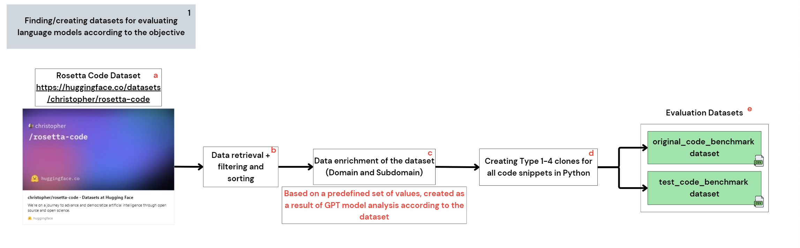

### Evaluation Dataset Creation for Language Model Benchmarking

This README explains the process used to create the final evaluation datasets for benchmarking language models. The datasets consist of two main files:
1. `original_code_benchmark.csv` – Contains original code snippets from the Rosetta Code dataset enriched with domain and subdomain information.
2. `test_code_benchmark.csv` – Contains cloned versions of the original code snippets, classified into various clone types and subtypes.

---



---

#### 1. Dataset Source
The original code snippets are sourced from the **Rosetta Code Dataset** available on [Hugging Face](https://huggingface.co/datasets/christopher/rosetta-code). This dataset includes code implementations for various programming tasks across multiple programming languages.

---

#### 2. Dataset Processing Pipeline
The pipeline for creating the evaluation datasets consists of the following stages:

##### a) **Data Retrieval and Filtering**
The `get_rosetta()` function in `handle_rosetta.py` loads the Rosetta Code dataset and filters it to include only supported programming languages (`python`, `javascript`, `java`, `go`, `ruby`, `php`).
- The data is saved as a Parquet file (`rosetta_raw.parquet`) for efficient storage.
- Tasks with excessively large code snippets (more than 32,700 characters) are excluded.

##### b) **Data Enrichment with Domain and Subdomain**
The `handle_domain_subdomain.py` script enriches each task in the dataset with its corresponding domain and subdomain based on a predefined taxonomy. This step involves:
- Using OpenAI’s GPT API to categorize each task into a domain and subdomain.
- Storing the enriched dataset in `rosetta_with_domains_subdomains.csv`.

##### c) **Clone Generation**
The `handle_clones.py` script generates cloned versions of each original code snippet. Clones are classified into four main types:
1. **Type 1**: Exact clones (e.g., different formatting, whitespace changes).
2. **Type 2**: Renamed clones (e.g., variable/function name changes).
3. **Type 3**: Near-miss clones (e.g., added/removed statements, reordered control flows).
4. **Type 4**: Semantic clones (e.g., equivalent implementations in other languages).

- Clone prompts are stored in `clone_prompts.csv`, and the GPT API is used to create variations of the code based on these prompts.

##### d) **Batch Processing**
The `evaluation_datasets_creation.py` script processes the dataset in batches to:
- Append the original code snippets to `original_code_benchmark.csv`.
- Append the generated clones to `test_code_benchmark.csv`.

This batching ensures memory efficiency and allows progress monitoring during dataset creation.

---

#### 3. Cost Estimation
The cost of creating domains, subdomains, and clones is calculated using `cost_calculation.py`. Token estimates and GPT API costs are printed to help monitor the computational expense of dataset creation.

---

#### 4. Output Files
The final output consists of two CSV files stored in the `evaluation-datasets` directory:
1. `original_code_benchmark.csv`: Contains columns like `base_code_id`, `language`, `task`, `domain`, `subdomain`, and `code`.
2. `test_code_benchmark.csv`: Contains columns like `clone_code_id`, `base_code_id`, `task`, `domain`, `subdomain`, `clone_language`, `clone_type`, `clone_sub_type`, and `code`.

---

#### 5. How to Recreate the Datasets
To recreate the datasets, follow these steps:
1. Clone this repository and install dependencies listed in `requirements.txt`.
2. Set up an `.env` file with your OpenAI API key:
   ```env
   OPENAI_KEY=your_openai_api_key
   ```
3. Run the main script:
   ```bash
   python evaluation_datasets_creation.py
   ```
4. Follow the prompts to process the Rosetta Code dataset, enrich it with domain and subdomain information, and generate clones.

---

#### 6. Notes
- The GPT model used for enrichment and clone generation is `gpt-4o-mini`.
- Ensure sufficient API credits and system memory before running the script.
- For questions or issues, refer to the `README.md` or open an issue in the repository.

